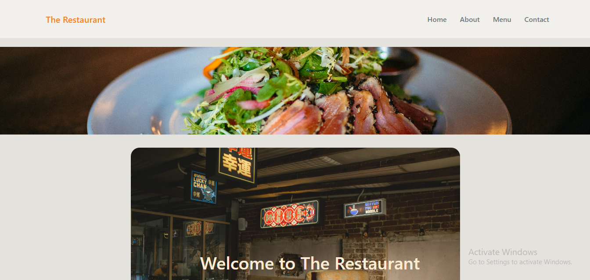
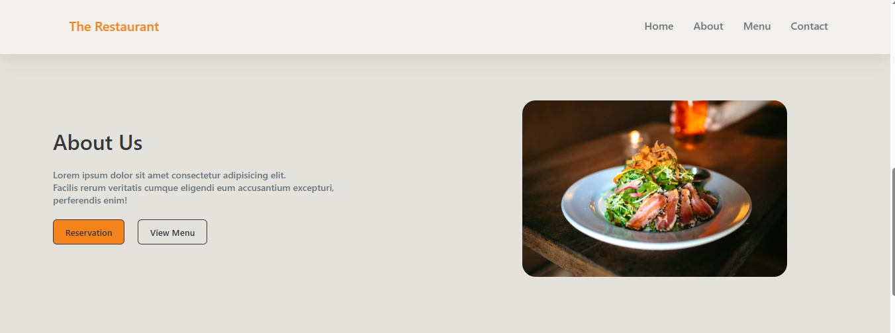
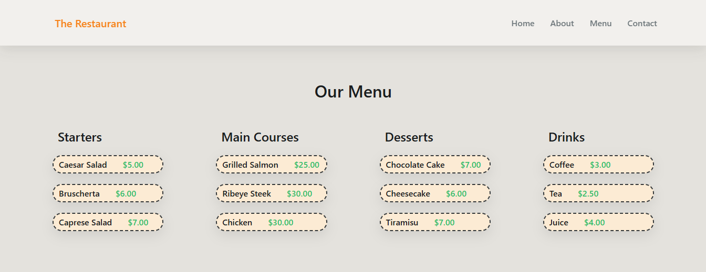
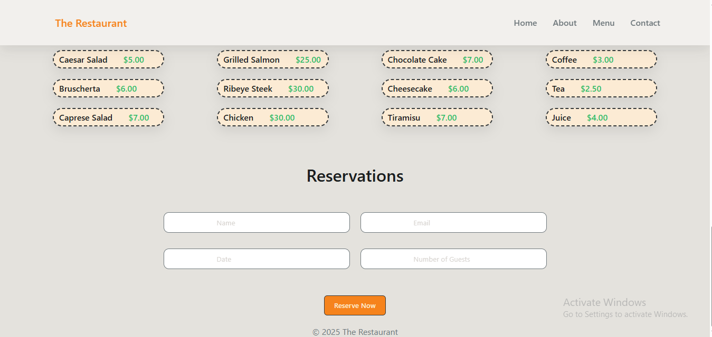

# The Restaurant - Responsive Web App

**The Restaurant** is a modern, fully responsive web application designed for showcasing a restaurant’s menu, about section, reservations, and hero banner with slider functionality. Built with **HTML**, **CSS**, and **JavaScript**, this project provides a smooth, interactive user experience for visitors.

---

## **Features**

- **Responsive Design**: Works perfectly on desktop, tablet, and mobile devices.
- **Navigation Bar**: Sticky navbar with smooth scrolling to sections.
- **Hero Section**: Eye-catching hero image with buttons for reservation and menu.
- **Image Slider**: Automatic sliding images to highlight dishes or promotions.
- **About Section**: Information about the restaurant with buttons for reservations and menu.
- **Menu Section**: Categorized food menu (Starters, Main Courses, Desserts, Drinks) with prices.
- **Reservation Form**: User-friendly form for booking tables.
- **Interactive Animations**: Smooth fade-in animations on scroll using Intersection Observer.
- **Modern UI**: Stylish buttons, hover effects, and shadowed cards.

---

## **Technologies Used**

- **HTML5**  
- **CSS3 (Flexbox, Grid, Variables)**  
- **JavaScript (ES6)**  
- **Font Awesome** for icons  

---
## Screenshots

### Hero Section

### Menu Section

### Reservation Form

### Footer

